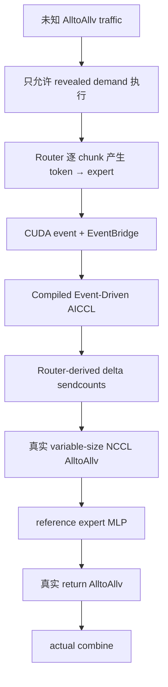

# RevealAICCL

> 在未来 AlltoAllv 流量未知时，只调度已经揭示的真实 demand，并将调度、通信与 Router 执行安全地重叠。
>
> Schedule only revealed demand under unknown future AlltoAllv traffic, then safely overlap routing, scheduling, and communication.

RevealAICCL 是一套研究型 reference implementation，用来回答一个具体问题：原始 AICCL 更适合完整 traffic 已知时的 collective scheduling，但真实 MoE 的 `token → expert` 流量由 Router 动态产生；在不预测、不读取未来 traffic 的前提下，AICCL 能否安全地提前工作，并获得端到端收益？

在冻结的 **2× Tesla V100-SXM2-32GB、PyTorch reference Router、Compiled Event-Driven AICCL、PyTorch distributed NCCL、reference full-MoE** 范围内，答案是肯定的：

- 未揭示 token/top-k 不会进入 ready state、packing 或通信；
- Router-derived variable-size forward AlltoAllv 的 formal paired median 收益为 **+0.829 ms**；
- 加入非渐进 expert MLP、真实 return AlltoAllv 与 actual combine 后，full-MoE formal paired median 收益为 **+2.801 ms**，95% CI **[+0.967, +3.714] ms**；
- 逐样本归一化的 full-MoE paired relative makespan reduction median 为 **+0.608%**，95% CI **[+0.225%, +0.960%]**，3/3 fresh formal seeds 为正；
- R5-P3 fast data-prep 将 per-descriptor packing p50 从 **10.844 ms** 降至 **0.828 ms**（paired median **13.214×**），count construction p50 从 **503.584 µs** 降至 **23.193 µs**（约 **21.71×**）；
- 在继承的 first-Router-launch primary timing 边界下，R5-P3 的 `E0 − E1` paired median 为 **+78.872 ms**，95% CI **[+76.626, +80.810] ms**，逐对相对完工时间降幅为 **+16.423%**，3/3 seeds、5/5 families 为正，因此 fast data-prep 已保留为新工程 baseline；
- 上述 primary timing 不包含边界之前的 static precompute；将其加回后的保守 diagnostic 为 **+3.498 ms**，95% CI **[+1.400, +5.549] ms**。因此不能把 **16.423%** 表述成包含全部新增准备成本的 production/E2E 净加速。

最新工程状态（2026-08-11）：R5-P3 的数据准备优化成功，但 optimized progressive timing Gate 未通过：相同 fast data-prep 下 `D1 − E1 = −3.093 ms`，0/3 seeds、0/5 families 为正。R5-P4 将该反转的主要额外成本诊断为 **collective/rank rendezvous dominated**。这不改写 R4-F0 的历史 formal PASS，但说明当前 optimized E1 尚未证明 progressive timing value。R6-M0 的 MSCCL integration 尝试已经完整回退；当前执行 backend 仍是 **PyTorch distributed NCCL**，不是 MSCCL/MSCCL++。

完整中英双语证据链见 [项目总结与证据报告](docs/UNKNOWN_TRAFFIC_PROGRESSIVE_AICCL_PROJECT_REPORT_BILINGUAL.md)。仓库现名为 [RevealAICCL](https://github.com/IronCarbonate/RevealAICCL)；内部 Python package 暂时保留 `rlccl` 名称以维持兼容性。

## 研究主线



冻结的数据路径为：

```text
reference PyTorch Router (deterministic top-k)
  → per-chunk CUDA completion event
  → native busy-poll EventBridge
  → IncrementalState (revealed chunks only)
  → StaticPlanCompiler + FastBinder + DynamicGuard
  → Router-derived delta counts / offsets
  → deterministic packing
  → real NCCL uneven-split forward all_to_all_single
  → non-progressive per-expert FP32 reference MLP
  → real NCCL uneven-split return all_to_all_single
  → original-token-position combine
```

关键语义保持为：`partial_current_only`、`partial_shards@75%`、`checkpoint8`、runtime BFS = 0、fast-path full rebuild = 0、deterministic/fail-closed checker，以及 no-future-demand access。

## 关键正式结果

所有主结果都使用 paired early/progressive 与 identical delayed control；正 `Delta = T_delayed - T_early` 表示渐进执行更快。Gate 在运行前冻结，不能用边际分位数或 overlap fraction 替代 paired Delta。

### R3-F0：真实 variable-size forward AlltoAllv

- Fresh formal seeds：`5042 / 5142 / 5242`。
- 五个冻结 traffic families，每 family/seed 20 jobs，共 **300 paired jobs**。
- Paired median Delta：**+0.829297 ms**。
- 10,000-resample bootstrap 95% CI：**[+0.242144, +1.439255] ms**。
- 三个 seed median：**+0.401 / +0.157 / +1.643 ms**，3/3 为正。
- Formal reference-scale ratio：`0.829297 / 67.074446 × 100% ≈ 1.236%`。这只是绝对 paired median 与 delayed marginal p50 的量级比，不是正式 paired-percentage statistic。
- Correctness：4,915,200 token records；legality/token integrity 100%；lost/duplicate/wrong-destination/corruption/future access 全为 0。

| Traffic family | Paired median Delta |
|---|---:|
| balanced | +0.050 ms |
| skewed | +1.213 ms |
| all-to-one-like | +1.499 ms |
| zero-sized-pair | +0.829 ms |
| multiple-progressive-shards | **−0.047 ms** |

详情：[R3-F0 formal report](docs/phase_r3/R3_F0_REPORT.md)。

### R4-F0：完整 reference MoE

Primary 从 first Router launch 计到 final combined output ready，包含 Router、forward packing/count exchange/A2Av、expert compute、return packing/count exchange/A2Av 与 actual combine；只排除 correctness-only oracle。

- Fresh formal seeds：`9042 / 9142 / 9242`。
- 五个 family 等比例，共 **300 paired jobs、1,200 rank-arm executions**。
- Paired median Delta：**+2.800709 ms**。
- Bootstrap 95% CI：**[+0.967251, +3.714117] ms**。
- 三个 seed median：**+2.860 / +3.597 / +1.053 ms**，3/3 为正。
- Paired relative makespan reduction median：**+0.607879%**，95% CI **[+0.225202%, +0.960018%]**。
- 三个 seed 的相对降幅 median：**+0.577% / +0.933% / +0.242%**。
- 300/300 paired comparisons、1,200/1,200 rank-arm executions correctness/equivalence PASS；所有 loss/duplication/wrong/future/divergence 计数为 0。

| Traffic family | Paired median Delta | Paired relative median |
|---|---:|---:|
| balanced | +6.736 ms | +1.744% |
| skewed | **−2.131 ms** | **−0.456%** |
| all-to-one-like | **−0.927 ms** | **−0.177%** |
| zero-sized-pair | +6.856 ms | +1.284% |
| multiple-progressive-shards | +3.912 ms | +1.023% |

这证明 corpus-wide paired median critical-path value，不表示每个 job、family 或 tail 都更快。详情：[R4-F0 formal report](docs/phase_r4/R4_F0_REPORT.md)。

## 2026-08-11：R5 工程更新

R5 在已通过 formal 的 R4 full-MoE 路径上探索进一步流水化与数据准备优化。所有负结果均保留，不以 correctness、overlap fraction 或 microbenchmark 加速替代 full-MoE makespan Gate。

| Phase | 改动 | Correctness / mechanism | Paired full-MoE 结果 | 裁决 |
|---|---|---|---|---|
| R5-P1 | 256-token threshold progressive expert | correctness + mechanism PASS；96.354% expert tokens 在 final forward 前完成 | `E0 − P = −53.951 ms`，CI `[−57.851, −47.824] ms`；relative `−11.016%`；0/3 seeds positive | **Performance FAIL；关闭该路径** |
| R5-P2 | unchanged expert batches 完成后尽早 return | correctness PASS；0/2,100 descriptors 在 final expert 前启动，hidden return = 0 | `E0 − P2 = −2.935 ms`，CI `[−5.130, −2.061] ms`；relative `−0.564%`；0/3 seeds positive | **Mechanism + performance FAIL；关闭该路径** |
| R5-P3 | preallocated buffers、incremental counts、vectorized packing、count/packing overlap | byte-exact correctness PASS；packing mechanism PASS | `E0 − E1 = +78.872 ms`（+16.423%）；但 `D1 − E1 = −3.093 ms`（−0.775%），0/3 seeds、0/5 families positive | **Fast data-prep PASS，保留为新 baseline；progressive timing FAIL** |
| R5-P4 | E1 progressive vs D1 delayed 的 CUPTI diagnosis | 45/45 semantic equivalence；trace association PASS | diagnostic E1 extra median `+2.272 ms`；3/3 seeds、5/5 families 同方向 | **Diagnosis PASS：collective/rank-rendezvous dominated** |

### R5-P1：progressive expert 为什么关闭

P1 的逐 expert FIFO 和 exact-once 执行均正确，并实际隐藏了大部分 expert interval；但碎片化 GEMM 与 device contention 使 expert GPU interval 相对 E0 的 paired degradation 达到 p50 **+207.204%**，最终 P 路径的逐对相对完工时间 median 退化 **11.016%**，95% CI **[10.397%, 11.927%]**。总 progressive pipeline 对 delayed-forward control 也为负：`D − P = −44.920 ms`，95% CI **[−50.513, −39.587] ms**。与此同时，未加入 progressive expert 的 forward control 仍复现 `D − E0 = +4.204 ms`，95% CI **[+2.620, +6.680] ms**，3/3 seeds positive；因此 P1 失败来自新增 expert mechanism，而不是历史 forward signal 在该 corpus 消失。这说明“隐藏了多少计算”不能替代 combined makespan。固定 threshold reference implementation 已关闭，不再继续调参。

详情：[R5-P1 report](docs/phase_r5/R5_P1_REPORT.md)。

### R5-P2：progressive return 为什么关闭

P2 不拆 GEMM、不改 return descriptors，只允许既有 descriptor 在依赖 expert 完成后启动。但每个 frozen return descriptor 都同时依赖两个 active local experts，因此都必须等待最后一个 expert；真实 return GPU work 没有被隐藏，额外 worker/control 开销反而使 median 退化 **2.935 ms**。逐对相对完工时间 median 退化 **0.564%**，95% CI **[0.460%, 1.163%]**。

详情：[R5-P2 report](docs/phase_r5/R5_P2_REPORT.md)。

### R5-P3：fast data-prep 成功，但 progressive timing 反转

P3 将 per-descriptor packing p50 从 **10,843.896 µs** 降到 **827.805 µs**，paired speedup median **13.214×**；count construction p50 从 **503.584 µs** 降到 **23.193 µs**，约 **21.71×**。因此 E1 相对 reference E0 的 full-MoE paired median 改善 **78.872 ms**，95% CI **[+76.626, +80.810] ms**；逐对相对完工时间降幅 median **16.423%**，95% CI **[+15.722%, +18.253%]**，3/3 seeds、5/5 families positive。

然而，在 E1 与同样优化的 delayed D1 之间，D1 反而快 **3.093 ms**：

- `D1 − E1 = −3.093 ms`，95% CI **[−4.189, −1.813] ms**；
- paired relative reduction **−0.775%**，95% CI **[−1.075%, −0.455%]**；
- 0/3 seed medians positive，0/5 family medians positive。

因此只能保留 fast data-prep 为新 baseline，不能声称 optimized progressive path 仍有性能收益。

Primary timing 继承了 R4 的 first-Router-launch 边界，而 P3 的 static route-independent precompute 位于该边界之前。为防止把边界外工作误当成收益，报告还给出保守的 precompute-inclusive diagnostic：`E0 − (E1 primary + E1 precompute)` median **+3.498 ms**，95% CI **[+1.400, +5.549] ms**，94/150 pairs positive。它说明 fast path 并非完全由计时边界制造，但也表明 **+78.872 ms** 不能直接解释成把所有新增准备成本都计入后的净收益。

详情：[R5-P3 report](docs/phase_r5/R5_P3_REPORT.md)。

### R5-P4：反转原因

P4 使用 fresh diagnostic seeds `13042 / 13142 / 13242`、45 pairs、315 descriptors/arm 直接分解 E1/D1：

| Diagnostic（p50 / p95） | E1 progressive | D1 delayed |
|---|---:|---:|
| Cross-rank ready skew | 16.113 / 41.324 ms | 0.617 / 4.676 ms |
| Count issue → both complete | 29.219 / 61.943 ms | 16.405 / 29.158 ms |
| Cross-rank payload GPU-start skew | 12.228 / 24.926 ms | 0.267 / 0.612 ms |
| Payload NCCL kernel envelope | 0.733 / 24.965 ms | 0.378 / 0.809 ms |
| Actual future-Router/payload overlap | 0/315 | 0/315 |

预注册 classifier 的描述性 attribution 为：

- **91.571% collective/rank-rendezvous group**：count rendezvous lifetime 36.206%、cross-rank ready skew 29.499%、payload launch/rank-start skew 25.866%；
- **8.429% resource group**：主要是 payload GPU kernel envelope 8.345%；Router GPU active work 仅 0.0003%。

这些比例是 **descriptive、non-causal、non-additive**，同一依赖链上的 skew、wait 与 kernel envelope 不能相加预测 makespan；尤其不能把它们解释为 `−3.093 ms` regression 的独立因果百分比分解。它们只回答哪类观测机制占主导。结论是当前主要问题来自 collective/rank rendezvous，而不是 Router 算术计算或单 rank CUDA launch latency。

详情：[R5-P4 diagnosis](docs/phase_r5/R5_P4_REPORT.md)。

## Backend 边界：当前是 NCCL，不是 MSCCL

当前 reference execution path 明确使用：

```python
torch.distributed.init_process_group("nccl")
torch.distributed.all_to_all_single(..., async_op=True)
```

- forward/return payload 均由 PyTorch distributed 的 NCCL process group 执行；
- 不等 split sizes 构成真实 variable-size AlltoAllv reference substrate；
- R5-P4 只建议后续评估 MSCCL，并未实现或验证 MSCCL backend；
- R6-M0 的 incremental adapter / integration 尝试已完整回退，当前仓库以 R5-P4 为冻结基线；
- 当前 tree 中没有 R6-M0 incremental adapter 或 runtime integration 代码；
- `rlccl/utils/xml_converter.py` 是历史 schedule-to-MSCCL-XML **离线导出工具**，它的存在不表示当前 MoE progressive runtime 使用 MSCCL。

因此不要把本仓库当前状态描述为 MSCCL、DeepEP、PCCL 或 production MoE backend。

## 快速开始

### 1. 本地语义与 correctness 测试

仓库目前没有锁定的 `requirements.txt`/environment 文件。请准备可用的 Python 3 环境，并安装 PyTorch、NumPy 与 pytest；GPU smoke 还需要与 PyTorch 匹配的 CUDA/NCCL。CPU 环境可先运行核心语义测试：

```bash
python -m pytest -q \
  tests/test_no_future_leakage.py \
  tests/test_uncertainty_environment.py \
  tests/test_r2_compiled_scheduler.py \
  tests/test_r3_reference_a2av.py \
  tests/test_r4_reference_full_moe.py
```

完整回归：

```bash
python -m pytest -q
```

部分 Torch/CUDA/NCCL 测试在缺少相应环境时会 skip；不要把 skip 解释为 GPU evidence 的本地复现。

### 2. 双 GPU reference substrate smoke

下面命令需要 Linux、两张 CUDA GPU、可用 NCCL，以及能够编译 PyTorch C++ extension 的本机构建工具链，仅用于小规模 correctness smoke：

```bash
torchrun --standalone --nproc_per_node=2 \
  scripts/run_r3_a0_c0.py \
  --output-dir outputs/r3_a0_c0_smoke \
  --case balanced \
  --allow-smoke
```

Full-MoE correctness smoke：

```bash
torchrun --standalone --nproc_per_node=2 \
  scripts/run_r4_a0_c0_full_moe.py \
  --output-dir outputs/r4_a0_c0_smoke \
  --case balanced \
  --allow-smoke
```

正式 R3/R4/R5 结果使用冻结 corpus、seed、counterbalancing、hash/read-back 与专用分析脚本。复现前应先阅读相应 preregistration；不要用 smoke 结果替代 formal evidence，也不要重跑 formal seed 后再修改 Gate。

## 仓库结构

```text
RevealAICCL/
├── rlccl/
│   ├── uncertainty/      # private truth / revealed observation / fail-closed execution
│   ├── scheduling/       # StaticPlanCompiler, IncrementalState, FastBinder, DynamicGuard
│   ├── transport/        # reference A2Av/full-MoE 与 R5 fast data-prep
│   ├── traffic/          # traffic generators and views
│   ├── models/           # reference policy/router-related model components
│   └── utils/            # utilities；含历史 MSCCL XML exporter，非当前 runtime backend
├── extensions/
│   └── r2_event_bridge/  # native low-latency CUDA-event bridge
├── scripts/              # gate runners、profilers 与 analyzers
├── tests/                # semantic/equivalence/correctness regression tests
├── docs/                 # preregistration、phase reports 与审计证据链
├── Data/                 # topology definitions
└── outputs/              # 本地/远程实验 artifacts；默认不纳入 Git
```

## 证据与文档索引

- [完整中英双语项目报告（截至 R4-F0）](docs/UNKNOWN_TRAFFIC_PROGRESSIVE_AICCL_PROJECT_REPORT_BILINGUAL.md)
- [R0 Evidence Repair](docs/phase_r0/EVIDENCE_REPAIR_REPORT.md)
- [R1 Real Concurrent Pipeline](docs/phase_r1/R1_C0_T0_REPORT.md)
- [R2 Compiled Event-Driven Architecture](docs/phase_r2/COMPILED_EVENT_DRIVEN_ARCHITECTURE.md)
- [R2 Compiled Equivalence](docs/phase_r2/R2_C0_REPORT.md)
- [R2 Device Overlap](docs/phase_r2/R2_O0_REPORT.md)
- [R2 Delayed Control / Transport](docs/phase_r2/R2_O1A_REPORT.md)、[R2-O1B](docs/phase_r2/R2_O1B_REPORT.md)
- [R3 substrate correctness](docs/phase_r3/R3_A0_C0_REPORT.md)、[R3 formal](docs/phase_r3/R3_F0_REPORT.md)
- [R4 full-MoE correctness](docs/phase_r4/R4_A0_C0_REPORT.md)、[R4 formal](docs/phase_r4/R4_F0_REPORT.md)
- [R5-P1](docs/phase_r5/R5_P1_REPORT.md)、[R5-P2](docs/phase_r5/R5_P2_REPORT.md)、[R5-P3](docs/phase_r5/R5_P3_REPORT.md)、[R5-P4](docs/phase_r5/R5_P4_REPORT.md)

`outputs/` 默认被 `.gitignore` 排除。报告中列出的 SHA-256 与 read-back 记录是 canonical evidence 的 provenance；GitHub checkout 主要包含代码、协议、报告与小型测试资产，不承诺包含所有大型 raw traces。

## 已知限制

- 这是 2×V100、双 rank、single-node 的 reference result，不是 production deployment result。
- Router、packing、FP32 expert MLP 与 combine 均为 reference implementation。
- 没有 expert-parallel training throughput、multi-node RDMA、DeepEP/PCCL、production packing 或 production fault tolerance 结论。
- R3/R4 存在 family heterogeneity；正式结论是 corpus-wide paired median 为正，不是 universal speedup。
- NCCL count exchange 有强 heavy tail；R5-P4 又确认 progressive rank rendezvous 可吞掉优化后的收益。
- R5-P1 progressive expert 与 R5-P2 progressive return 已关闭；不要从代码中的 opt-in 实验入口推断它们是当前默认路径。
- 原始 L1 raw jobs 已丢失，历史 derived summary 保留但不得重造 raw 冒充原证据。
- 历史 P10-1D 是 readiness replay，不是真实 concurrent pipeline；419.84 µs 只是 replay-derived candidate window。
- 1.043/1.140/2.047 ms 是 implementation estimates，不是 strict/theoretical lower bounds。

## English summary

RevealAICCL studies whether AICCL can schedule useful MoE communication before the full Router-derived AlltoAllv traffic matrix is known, without predicting or accessing future demand. The implemented system exposes only completed Router chunks, incrementally updates compiled scheduler state, and executes real uneven-split PyTorch/NCCL `all_to_all_single` operations.

Formal validation on two V100 GPUs reports a **+0.829 ms** paired median benefit for progressive forward variable-size A2Av, 95% CI **[+0.242, +1.439] ms**. The complete reference MoE path reports **+2.801 ms**, 95% CI **[+0.967, +3.714] ms**, with a **+0.608%** median paired relative makespan reduction and 95% CI **[+0.225%, +0.960%]**. All three fresh formal seeds are positive and correctness/no-future-access checks pass. These corpus-wide paired results are not universal per-family or tail speedups.

The latest R5 work adds an important qualification. Progressive expert execution is correct but `E0 − P = −53.951 ms`, 95% CI **[−57.851, −47.824] ms**; the current progressive-return graph is correct but has zero legal pre-final-expert return starts and `E0 − P2 = −2.935 ms`, 95% CI **[−5.130, −2.061] ms**. Both paths have been closed. Fast data preparation is retained: under the inherited first-Router-launch timing boundary, it improves reference E0→E1 by **78.872 ms**, 95% CI **[+76.626, +80.810] ms**, with a **16.423%** median paired reduction and reduces median packing time by **13.214×**. Static route-independent precompute sits before that primary boundary; adding it back gives the more conservative diagnostic `E0 − (E1 primary + E1 precompute) = +3.498 ms`, 95% CI **[+1.400, +5.549] ms**. However, optimized progressive E1 is **3.093 ms slower** than identically optimized delayed D1, 95% CI **[1.813, 4.189] ms slower**, with 0/3 seed and 0/5 family medians positive. This does not rewrite the historical R4-F0 PASS, but the optimized E1 path has not demonstrated progressive timing value.

R5-P4 classifies the observed extra cost as **91.571% collective/rank-rendezvous group** and **8.429% resource group**. Those normalized positive-cost shares are descriptive, non-causal, and non-additive manifestations of one dependency chain; they are not independent causal percentages of the 3.093 ms regression. Router arithmetic and single-rank CUDA launch latency were not the dominant observations.

The active backend is **PyTorch distributed NCCL**, not MSCCL/MSCCL++. The exploratory R6-M0 MSCCL integration was fully rolled back, and no R6 incremental adapter/runtime-integration code remains in the current tree; legacy XML-export utilities do not constitute an MSCCL runtime path. The repository is now named [RevealAICCL](https://github.com/IronCarbonate/RevealAICCL), while the internal `rlccl` Python package name is retained for compatibility.

## 引用 / Citation

若基于本项目开展研究，请引用本仓库及其 [双语证据报告](docs/UNKNOWN_TRAFFIC_PROGRESSIVE_AICCL_PROJECT_REPORT_BILINGUAL.md)，并在结果中明确区分 reference NCCL evidence、formal paired Gate、diagnostic attribution 与尚未实现的 production backend。当前仓库未提供正式论文 DOI/BibTeX；在公开发布前请同时核对许可证与作者信息。
